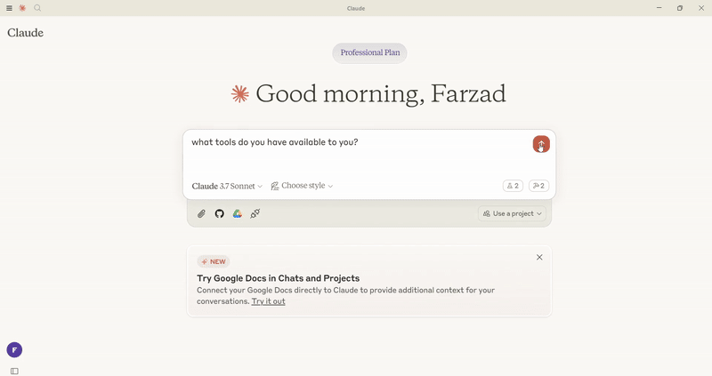

# Azure AI Agent Service MCP Adapter

A Model Context Protocol (MCP) adapter that enables Claude Desktop to connect to your existing Azure AI Agents.



## Overview

This adapter creates a bridge between Claude Desktop and your existing Azure AI Agents. It allows Claude to interact with your agents through the Model Context Protocol (MCP), without having to build any custom code.

## Features

- 🤖 **Agent Integration** - Connect to your existing Azure AI Agents
- 🔄 **Seamless Workflow** - Use your agents directly within Claude Desktop
- 🛡️ **Secure** - All connections use your Azure credentials

## Prerequisites

- Python 3.10+
- Claude Desktop (latest version)
- Azure CLI (`az`) installed and configured
- Existing Azure AI Agents with desired capabilities

## Quick Start

### 1. Configure Azure

1. Create Azure AI Agents through Azure AI Studio
2. Note your Azure AI Project connection string
3. Note your agents' IDs (you'll need these to connect to specific agents)
4. Authenticate: `az login`

### 2. Set Environment Variables

Create an `.env` file:

```bash
# Required
PROJECT_CONNECTION_STRING=your-project-connection-string

# Optional (configure default agent)
DEFAULT_AGENT_ID=your-default-agent-id
```

### 3. Install and Run

```bash
# Setup environment
uv venv
.venv\Scripts\activate  # On Windows
source .venv/bin/activate  # On macOS/Linux

# Install dependencies
uv add mcp[cli] azure-identity python-dotenv azure-ai-projects

# Run adapter
python -m azure_agent_mcp_adapter
```

### 4. Configure Claude Desktop

Add to your Claude Desktop configuration file:

```json
{
  "mcpServers": {
    "azure-agent": {
      "command": "uv",
      "args": [
        "--directory",
        "/ABSOLUTE/PATH/TO/PARENT/FOLDER",
        "run",
        "-m",
        "azure_agent_mcp_adapter"
      ],
      "env": {
        "PROJECT_CONNECTION_STRING": "your-project-connection-string",
        "DEFAULT_AGENT_ID": "your-default-agent-id"
      }
    }
  }
}
```

## Available Tools

The server provides the following tools:

`connect_agent`: Connect to a specific Azure AI Agent by ID.

**Parameters:**

- `agent_id` (string): The ID of the Azure AI Agent to connect to
- `query` (string): The question or request to send to the agent
- `thread_id` (string, optional): Thread ID for continuation of conversation

`query_default_agent`: Send a query to the default configured agent.

**Parameters:**

- `query` (string): The question or request to send to the agent
- `thread_id` (string, optional): Thread ID for continuation of conversation

## Development Notes
This project follows a polyglot structure with Python code located in the python directory. When running or developing:

1. Always activate the virtual environment from the project root
2. Navigate to the python directory when running Python commands
3. For package installation, ensure you're in the python directory where pyproject.toml is located

## Troubleshooting

- **Connection Issues**: Verify Azure credentials, connection strings, and agent configurations
- **Agent Failures**: Ensure your agents are correctly configured and that the queries are valid for the agent's capabilities
- **Module Not Found**: Ensure you're running the module from the python directory

## License

This project is licensed under the MIT License.
