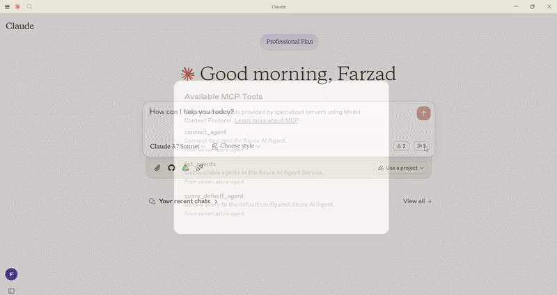

# Azure AI Agent Service MCP Server

This MCP server integrates with Azure AI Foundry to enable connections to your existing Azure AI Agents, utilizing the wide range of models and knowledge tools available within Azure AI Foundry, such as Azure AI Search and Bing Web Grounding.



[](https://github.com/azure-ai-foundry/mcp-foundry/watchers)
[](https://github.com/azure-ai-foundry/mcp-foundry/fork)
[](https://github.com/azure-ai-foundry/mcp-foundry/stargazers)

[](https://discord.gg/REmjGvvFpW)

## Features

- 🤖 **Agent Integration** - Connect to your existing Azure AI Agents
- 🔄 **Seamless Workflow** - Use your agents directly within any MCP client
- 🛡️ **Secure** - All connections use your Azure credentials
- 🧠 **Conversation Memory** - Each client session maintains isolated conversation history

## Tools

- **connect_agent**

  - Connect to a specific Azure AI Agent by ID
  - Inputs:
    - `agent_id` (string): The ID of the Azure AI Agent to connect to
    - `query` (string): The question or request to send to the agent
    - `thread_id` (string, optional): Thread ID for continuation of conversation
  - Returns: Formatted response from the agent

- **query_default_agent**

  - Send a query to the default configured agent
  - Inputs:
    - `query` (string): The question or request to send to the agent
    - `thread_id` (string, optional): Thread ID for continuation of conversation
  - Returns: Formatted response from the default agent

- **list_agents**
  - List all available Azure AI Agents in your project
  - Returns: List of available agents with their IDs and names

## Configuration

### Setting up Azure

1. Create Azure AI Agents through Azure AI Foundry
2. Note your Azure AI Project connection string
3. Note your agents' IDs (you'll need these to connect to specific agents)
4. Authenticate using Azure credentials: `az login`

### Environment Variables

This server requires the following environment variables:

```bash
# Required
PROJECT_CONNECTION_STRING=your-project-connection-string

# Optional (configure default agent)
DEFAULT_AGENT_ID=your-default-agent-id
```

## Installation

### Prerequisites

- Python 3.10+
- Azure CLI `(az)` installed and configured
- Existing Azure AI Agents with desired capabilities

#### Python Setup

```bash
# Setup environment
python -m venv .venv
.venv\Scripts\activate  # On Windows
source .venv/bin/activate  # On macOS/Linux

# Install dependencies
pip install mcp[cli] azure-identity python-dotenv azure-ai-projects aiohttp

# Run server directly (from ./src/python)
python -m azure_agent_mcp_server
```

If you prefer using uv:

```bash
# Setup environment with uv
uv venv
.venv\Scripts\activate  # On Windows
source .venv/bin/activate  # On macOS/Linux

# Install dependencies
uv add mcp[cli] azure-identity python-dotenv azure-ai-projects aiohttp

# Run server (F)
uv run -m azure_agent_mcp_server
```

#### TypeScript Setup

```bash
# Navigate to the TypeScript directory
cd src/typescript

# Install dependencies
npm install

# Build the server
npm run build

# Run the server
npm start
```

### Usage with Claude Desktop

To use with Claude Desktop, add the following to your configuration file:

#### Python Version

```json
{
  "mcpServers": {
    "azure-agent": {
      "command": "uv",
      "args": [
        "--directory",
        "/ABSOLUTE/PATH/TO/PARENT/FOLDER",
        "run",
        "-m",
        "azure_agent_mcp_server"
      ],
      "env": {
        "PROJECT_CONNECTION_STRING": "your-project-connection-string",
        "DEFAULT_AGENT_ID": "your-default-agent-id"
      }
    }
  }
}
```

If you don't want to use `uv`, you can use python:

```json
{
  "mcpServers": {
    "azure-agent": {
      "command": "python",
      "args": ["-m", "azure_agent_mcp_server"],
      "cwd": "/ABSOLUTE/PATH/TO/PARENT/FOLDER",
      "env": {
        "PYTHONPATH": "/ABSOLUTE/PATH/TO/PARENT/FOLDER",
        "PROJECT_CONNECTION_STRING": "your-project-connection-string",
        "DEFAULT_AGENT_ID": "your-default-agent-id"
      }
    }
  }
}
```

#### TypeScript Version

```json
{
  "mcpServers": {
    "azure-agent": {
      "command": "node",
      "args": ["/ABSOLUTE/PATH/TO/mcp-foundry/src/typescript/build/index.js"],
      "env": {
        "PROJECT_CONNECTION_STRING": "your-project-connection-string",
        "DEFAULT_AGENT_ID": "your-default-agent-id"
      }
    }
  }
}
```

### Usage with Other MCP Clients

This server follows the MCP protocol specification and can be used with any MCP-compatible client. Refer to your client's documentation for specific instructions on how to connect to external MCP servers.

## Development Notes

This project follows a polyglot structure with implementations in both Python and TypeScript:

### Python Development

1. Python code is located in the src/python directory
2. Always activate the virtual environment from the project root
3. For package installation, ensure you're in the Python directory where pyproject.toml is located

### TypeScript Development

1. TypeScript code is located in the src/typescript directory
2. Uses ES Modules for modern JavaScript compatibility
3. Standard npm workflow: `npm install` → `npm run build` → `npm start`

## License

This project is licensed under the MIT License. This means you are free to use, modify, and distribute the software, subject to the terms and conditions of the MIT License. For more details, please see the LICENSE file in the project repository.
